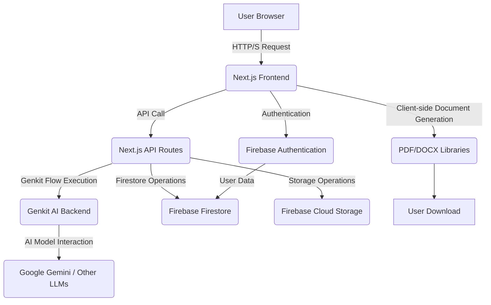

# Project Comprehensive Documentation: MediGen - AI-Powered Clinical Insights

This document serves as a comprehensive guide to the MediGen web application, providing detailed insights into its purpose, architecture, functionalities, technology stack, and development practices. It is designed to enable any new developer or AI agent to quickly understand the project and contribute effectively.

## 1. Project Overview

### 1.1. Purpose and Vision
MediGen is an AI-powered web application designed to assist medical professionals and students with provisional diagnoses, clinical question answering, and medical content generation. It leverages advanced AI models (specifically Google Gemini via Genkit) to process patient data and medical topics, providing structured and actionable insights. The vision is to streamline medical analysis and content creation, making complex medical information more accessible and manageable.

### 1.2. Target Audience
The primary users of MediGen are medical professionals (doctors, researchers) and medical students who require assistance with:
*   Generating provisional diagnoses based on patient data.
*   Obtaining detailed answers to clinical questions.
*   Creating structured medical presentations and educational content.

### 1.3. Key Features at a Glance
*   **AI Diagnosis**: Input patient data (text/images) to receive AI-generated provisional diagnoses with confidence levels and reasoning.
*   **Content Generator**: Create structured presentation outlines and detailed slides based on clinical questions or general medical topics, with options for AI-powered modification and export to PDF/DOCX.
*   **History Management**: View and manage past AI diagnosis and content generation cases.
*   **Authentication**: Secure user login, signup, and session management using Firebase Authentication.
*   **Responsive UI**: A modern, consistent, and accessible user interface built with Next.js, Tailwind CSS, and Shadcn UI.

## 2. High-Level Architecture

MediGen follows a modern full-stack architecture, primarily built with Next.js, leveraging its capabilities for both frontend rendering and backend API routes. AI integration is handled via Genkit, and data persistence is managed by Firebase.



### 2.1. Frontend (Next.js Application)
*   **Framework**: Next.js (React) for server-side rendering (SSR) and client-side interactivity.
*   **Styling**: Tailwind CSS for utility-first styling, complemented by Shadcn UI components built on Radix UI.
*   **State Management**: React Context for global authentication state, and React's `useState`/`useEffect` for local component state.
*   **Form Handling**: React Hook Form with Zod for robust form validation.

### 2.2. Backend (Next.js API Routes & Genkit AI)
*   **API Routes**: Next.js API routes (`src/app/api/`) serve as the backend for handling requests from the frontend, orchestrating AI calls, and interacting with Firebase.
*   **Genkit AI**: Genkit (`src/ai/`) is used to define and manage AI flows, abstracting interactions with large language models (LLMs) like Google Gemini. It provides structured inputs/outputs for AI operations.

### 2.3. Data Storage (Firebase)
*   **Firebase Firestore**: A NoSQL cloud database used for storing structured application data, such as user cases (diagnoses, content generations) and user profiles.
*   **Firebase Cloud Storage**: Used for storing larger files, primarily user-uploaded images and generated output data (e.g., JSON blobs of slides).
*   **Firebase Authentication**: Manages user accounts, login, signup, and session persistence.

### 2.4. Document Generation
*   Client-side libraries (`jspdf`, `docx`, `file-saver`) are used to generate and download PDF and Word documents directly in the user's browser, ensuring privacy and reducing server load.

## 3. Core Functionalities - Detailed Breakdown

### 3.1. AI Diagnosis

#### 3.1.1. Description
This feature allows users to input patient data (symptoms, medical history, etc.) and/or upload supporting documents (PDFs, images) to receive AI-generated provisional diagnoses, clinical answers, and reasoning.

#### 3.1.2. AI Flows Involved (`src/ai/flows/`)
*   **`ai-diagnosis.ts`**: The core diagnostic flow. Takes patient data and images, outputs potential diagnoses with confidence levels, reasoning, and suggestions for missing information/tests.
*   **`summarize-question.ts`**: Processes user input (text/images) to extract and reformat the clinical question into a structured summary.
*   **`answer-clinical-question.ts`**: Provides detailed answers to clinical questions, including step-by-step reasoning and a concise topic title.

#### 3.1.3. UI/UX Flow (`src/app/ai-diagnosis/page.tsx`)
1.  **Input Interface**: Users provide patient history via a textarea and can upload/paste images (JPG, PNG) or PDFs.
2.  **File Management**: Previews of uploaded images are displayed, with options to remove them.
3.  **Processing**: Upon submission, skeleton loaders provide visual feedback during AI processing.
4.  **Results Display**: AI-generated diagnoses are presented in `DiagnosisCard` components. The clinical answer and reasoning are shown, with reasoning expandable via an accordion.
5.  **Controls**: "New Case" button to clear inputs, and copy buttons for AI-generated text.

#### 3.1.4. Data Persistence
*   Cases are saved to Firebase Firestore (`cases` collection) with `userId`, `type` (`diagnosis`), `title`, `createdAt`, `inputData` (question, images), and `outputDataUrl` (link to a JSON blob in Cloud Storage).
*   The full AI response (diagnoses, answer, reasoning) is stored as a JSON blob in Firebase Cloud Storage.

### 3.2. Content Generator

#### 3.2.1. Description
This feature enables users to generate detailed answers to clinical questions or create structured presentation outlines based on a medical topic. It offers advanced functionalities for AI-powered slide modification and export.

#### 3.2.2. AI Flows Involved (`src/ai/flows/`)
*   **`generate-presentation-outline.ts`**: Generates a structured outline of topics for a medical presentation based on a clinical question/answer or a general topic.
*   **`generate-slide-content.ts`**: Creates detailed slide content for selected topics from an outline.
*   **`generate-single-slide.ts`**: Generates content for a single new slide, used when adding sections to an existing presentation.
*   **`modify-slides.ts`**: Modifies existing slides based on user actions (`expand_content`, `replace_content`, `expand_selected`).
*   **`suggest-new-topics.ts`**: Suggests additional technical medical topics based on the current context (question or general topic) and existing topics.

#### 3.2.3. UI/UX Flow (`src/app/content-generator/page.tsx`)
1.  **Mode Selection**: Users choose between "Specific Clinical Question" and "General Medical Topic" input modes.
2.  **Input Interface**: Depending on the mode, users provide a clinical question (text/images) or a general medical topic.
3.  **Outline Generation**: For general topics, a "Generate Presentation Outline" button triggers the creation of a topic outline. For clinical questions, the outline is generated after getting the initial answer.
4.  **Topic Selection**: The generated outline is displayed with checkboxes, allowing users to select topics for presentation generation.
5.  **Slide Editor (`src/components/SlideEditor.tsx`)**:
    *   **Slide Management**: Displays generated slides, allowing individual slide removal.
    *   **Add Section**: A dialog allows users to add new slides by selecting from suggested topics (from the initial outline or new AI-generated suggestions) or by entering a custom topic.
    *   **Reorder Slides**: Drag-and-drop functionality to reorder slides.
    *   **AI Modification**: Buttons to trigger `expand_content`, `replace_content`, and `expand_selected` actions on selected slides.
    *   **Export Options**: Functionality to copy raw JSON content, and export the presentation to PDF or Word documents.

#### 3.2.4. Data Persistence
*   Content generation cases are saved to Firebase Firestore (`cases` collection) with `userId`, `type` (`content-generator`), `title` (derived from topic/question), `createdAt`, `inputData` (mode, question/topic, images), and `outputDataUrl`.
*   The generated outline, slides, suggested topics, and used topics are stored as a JSON blob in Firebase Cloud Storage, linked via `outputDataUrl`.

### 3.3. History Management

#### 3.3.1. Description
This feature provides users with a centralized place to view and manage their past AI diagnosis and content generation cases.

#### 3.3.2. UI/UX Flow (`src/app/history/page.tsx`)
1.  **Authentication Check**: Ensures the user is logged in before displaying history.
2.  **Data Fetching**: Fetches real-time case data from Firebase Firestore, filtered by the current user's ID and ordered by creation date.
3.  **Case Display**: Each case is rendered using a `HistoryCard` component (`src/components/HistoryCard.tsx`).
4.  **Loading/Empty States**: Provides visual feedback during data loading or if no cases are found.
5.  **Case Navigation**: "View Case" buttons on `HistoryCard` components navigate to the relevant page (`/ai-diagnosis` or `/content-generator`) with a `caseId` parameter to load the specific case.

#### 3.3.3. Data Persistence
*   Relies on the case data saved by the AI Diagnosis and Content Generator features in Firebase Firestore.

### 3.4. Authentication

#### 3.4.1. Description
This feature manages user login, signup, and session persistence using Firebase Authentication.

#### 3.4.2. Key Components & UI/UX Flow
*   **`LoginPage` (`src/app/login/page.tsx`)**:
    *   Provides forms for email/password login and signup.
    *   Supports Google Sign-In for quick authentication.
    *   Displays loading indicators and toast notifications for authentication status.
    *   Automatically redirects authenticated users to the application's homepage.
*   **`AuthContext` (`src/context/AuthContext.tsx`)**:
    *   Uses React Context to provide the current `user` object and `loading` status to all wrapped components.
    *   Integrates with Firebase `onAuthStateChanged` to keep authentication state synchronized.
    *   Handles and displays errors if Firebase environment variables are missing.
*   **`Header` Component (`src/components/Header.tsx`)**:
    *   Displays the user's avatar and email if logged in, or a "Login" button if not.
    *   Provides a logout option for authenticated users.

#### 3.4.3. Data Persistence
*   Firebase Authentication handles user credentials and session management securely.

## 4. Technology Stack

MediGen is built using a modern and robust technology stack, designed for scalability, performance, and developer experience.

### 4.1. Frontend Technologies
*   **Next.js (v15.x)**: A React framework for building full-stack web applications. Used for server-side rendering, routing, API routes, and optimized builds.
*   **React (v18.x)**: JavaScript library for building user interfaces.
*   **TypeScript (v5.x)**: Superset of JavaScript that adds static typing, improving code quality and maintainability.
*   **Tailwind CSS (v3.x)**: A utility-first CSS framework for rapidly building custom designs.
*   **Radix UI**: A collection of unstyled, accessible UI components that integrate seamlessly with Tailwind CSS (used via Shadcn UI).
*   **Shadcn UI**: A collection of reusable components built with Radix UI and Tailwind CSS, providing a consistent and customizable design system.
*   **React Hook Form (v7.x)**: A performant and flexible library for form validation with React.
*   **Zod (v3.x)**: A TypeScript-first schema declaration and validation library, used for form validation and API input validation.
*   **`@dnd-kit/core` & `@dnd-kit/sortable`**: Libraries for implementing drag-and-drop functionality, specifically for reordering slides in the `SlideEditor`.
*   **`recharts`**: A composable charting library built with React, potentially used for data visualization (though not explicitly seen in current UI flows, its presence suggests future use or a hidden feature).

### 4.2. Backend & AI Integration Technologies
*   **Node.js**: JavaScript runtime environment for Next.js API routes and Genkit AI backend.
*   **Genkit (v1.x)**: An open-source framework for building AI-powered applications. It provides tools for orchestrating AI models, defining flows, and integrating with various AI providers.
*   **Google AI (Gemini)**: The primary large language model (LLM) used for AI capabilities (diagnosis, content generation, topic suggestion).
*   **Firebase**: Google's mobile and web application development platform.
    *   **Firebase Authentication**: For user authentication (email/password, Google Sign-In).
    *   **Firebase Firestore**: NoSQL cloud database for storing application data.
    *   **Firebase Cloud Storage**: For storing user-uploaded files (images, PDFs) and large JSON output blobs.

### 4.3. Document Generation & Utilities
*   **`docx` (v8.x)**: A library for generating `.docx` (Microsoft Word) files programmatically.
*   **`jspdf` (v2.x)**: A client-side JavaScript library for generating PDF documents.
*   **`jspdf-autotable` (v3.x)**: A plugin for `jspdf` to easily generate tables in PDF documents.
*   **`file-saver` (v2.x)**: A client-side utility for saving files generated in the browser.
*   **`uuid` (v11.x)**: A library for generating universally unique identifiers.
*   **`date-fns` (v3.x)**: A comprehensive JavaScript date utility library.
*   **`clsx`**: A tiny utility for constructing `className` strings conditionally.
*   **`tailwind-merge`**: A utility for merging Tailwind CSS classes without style conflicts.

## 5. Codebase Structure and Key Files

The project follows a standard Next.js application structure, with clear separation of concerns. Below is an overview of the most important directories and files:

```
.eslintrc.json              # ESLint configuration
.gitignore                  # Git ignore rules
next.config.ts              # Next.js configuration
package-lock.json           # npm dependency lock file
package.json                # Project metadata and dependencies
postcss.config.mjs          # PostCSS configuration (for Tailwind CSS)
tailwind.config.ts          # Tailwind CSS configuration
tsconfig.json               # TypeScript configuration
apphosting.yaml             # Configuration for app hosting (e.g., Google Cloud App Engine)
cors.json                   # CORS configuration
FEATURE_IMPLEMENTATION_PLAN.md # Documentation for planned features
PROJECT_DESCRIPTION.md      # High-level project description
PROJECT_FUNCTIONALITY.md    # Detailed project functionality overview
README.md                   # Project README
STYLE_GUIDE.md              # Design system and styling guidelines
UI-REFRESH.md               # UI/UX refactoring report

public/
├───hero-image.svg          # Static assets
└───fonts/                  # Custom fonts

src/
├───ai/                     # Genkit AI configurations and flows
│   ├───dev.ts              # Genkit development setup
│   ├───genkit.ts           # Genkit core configuration
│   └───flows/              # Individual AI flows (e.g., diagnosis, content generation)
│       ├───ai-diagnosis.ts
│       ├───answer-clinical-question.ts
│       ├───generate-presentation-outline.ts
│       ├───generate-single-slide.ts
│       ├───generate-slide-content.ts
│       ├───modify-slides.ts
│       ├───suggest-new-topics.ts
│       └───summarize-question.ts
├───app/                    # Next.js application pages and API routes
│   ├───favicon.ico
│   ├───globals.css         # Global CSS styles (including Tailwind base and custom CSS variables)
│   ├───layout.tsx          # Root layout for the application
│   ├───page.tsx            # Main landing page
│   ├───ai-diagnosis/       # AI Diagnosis feature pages
│   │   └───page.tsx
│   ├───api/                # Next.js API routes
│   │   ├───content-generator/ # API for content generation actions
│   │   │   └───route.ts
│   │   ├───generate-outline/ # API for outline generation
│   │   │   └───route.ts
│   │   ├───generate-slides/ # API for slide generation
│   │   │   └───route.ts
│   │   ├───modify-slides/  # API for slide modification
│   │   │   └───route.ts
│   │   └───suggest-topics/ # API for suggesting new topics
│   │       └───route.ts
│   ├───content-generator/  # Content Generator feature pages
│   │   └───page.tsx
│   ├───history/            # History feature pages
│   │   └───page.tsx
│   └───login/              # Authentication pages
│       └───page.tsx
├───components/             # Reusable React UI components
│   ├───DiagnosisCard.tsx
│   ├───Header.tsx
│   ├───HistoryCard.tsx
│   ├───QuestionDisplay.tsx
│   ├───SlideEditor.tsx
│   └───ui/                 # Shadcn UI components (auto-generated/customized)
├───context/                # React Context API providers
│   ├───AuthContext.tsx     # Authentication context
│   └───ThemeContext.tsx    # Theme context (light/dark mode)
├───hooks/                  # Custom React hooks
│   ├───use-mobile.tsx
│   ├───use-toast.ts
│   └───useAuth.ts
├───lib/                    # Utility functions, configurations, and external integrations
│   ├───design-tokens.ts    # Centralized design system variables
│   ├───firebase.ts         # Firebase initialization and utilities
│   ├───utils.ts            # General utility functions
│   └───pdf-fonts/          # Custom font registrations for PDF generation
│       ├───NotoSansBold.ts
│       ├───NotoSansItalic.ts
│       └───NotoSansRegular.ts
└───types/                  # TypeScript type definitions and interfaces
    ├───index.ts
    └───schemas.ts
```

### 5.1. Key Directories Explained
*   **`src/ai/flows/`**: Contains the core AI logic. Each `.ts` file here defines a specific AI flow using Genkit, encapsulating the prompts, models, and processing steps for a particular AI task.
*   **`src/app/`**: This is the heart of the Next.js application. It defines the application's routes (both UI pages and API endpoints). Each folder within `app/` typically represents a distinct feature or route segment.
*   **`src/components/`**: Houses all reusable React components. The `ui/` subdirectory specifically contains components from Shadcn UI, which are often customized or extended.
*   **`src/context/`**: Manages global state that needs to be accessible across multiple components without prop-drilling.
*   **`src/hooks/`**: Contains custom React hooks to encapsulate reusable logic and stateful behavior.
*   **`src/lib/`**: A general-purpose directory for utility functions, configurations (like Firebase setup), and design tokens. This is where shared, non-component-specific code resides.
*   **`src/types/`**: Dedicated to TypeScript type definitions and Zod schemas, ensuring strong typing throughout the application.

## 6. Development Workflow

This section outlines the essential commands and practices for developing, building, and maintaining the MediGen application.

### 6.1. Local Development Setup
1.  **Clone the repository**: `git clone <repository-url>`
2.  **Install dependencies**: Navigate to the project root and run `npm install`.
3.  **Environment Variables**: Create a `.env.local` file in the project root based on a `.env.example` (if available) or consult project maintainers for necessary Firebase and Genkit API keys. Example:
    ```
    NEXT_PUBLIC_FIREBASE_API_KEY=your_api_key
    NEXT_PUBLIC_FIREBASE_AUTH_DOMAIN=your_auth_domain
    # ... other Firebase config
    GENKIT_GOOGLE_API_KEY=your_genkit_google_api_key
    ```

### 6.2. Running the Application
*   **Start Frontend Development Server**: `npm run dev`
    *   This command starts the Next.js development server, typically on `http://localhost:9002` (as configured in `package.json`). It includes hot-reloading for rapid development.
*   **Start Genkit Development Server**: `npm run genkit:dev`
    *   This command starts the Genkit development server, which hosts the AI flows. It's essential for the AI functionalities to work locally.
*   **Start Genkit Development Server (Watch Mode)**: `npm run genkit:watch`
    *   Similar to `genkit:dev` but automatically restarts the Genkit server when changes are detected in the AI flow files.

### 6.3. Building and Running for Production
*   **Build Application**: `npm run build`
    *   Compiles the Next.js application for production, optimizing code, assets, and generating static files.
*   **Start Production Server**: `npm run start`
    *   Starts the Next.js application in production mode. This should only be run after `npm run build`.

### 6.4. Code Quality and Checks
*   **Linting**: `npm run lint`
    *   Runs ESLint to identify and report on patterns found in JavaScript/TypeScript code, ensuring code style consistency and catching potential errors.
*   **Type Checking**: `npm run typecheck`
    *   Runs the TypeScript compiler (`tsc`) to check for type errors in the codebase. This is crucial for maintaining type safety and preventing runtime bugs.

### 6.5. Deployment Considerations
*   The application is a Next.js application, making it highly suitable for deployment on platforms like Vercel, Netlify, or any Node.js hosting environment.
*   **Environment Variables**: Ensure all necessary environment variables (Firebase credentials, Genkit API keys) are securely configured in the deployment environment.
*   **Firebase Project Setup**: A Firebase project must be set up with Authentication, Firestore, and Cloud Storage enabled and configured.
*   **Genkit Backend**: The Genkit AI flows run as part of the Next.js serverless functions (API routes) or a separate Genkit server, depending on the deployment strategy. Ensure the deployment environment supports this.

## 7. Design System and UI/UX Guidelines

MediGen adheres to a consistent design system to ensure a cohesive and accessible user experience. This system is primarily defined through design tokens and implemented using Tailwind CSS and Shadcn UI.

### 7.1. Design Tokens (`src/lib/design-tokens.ts`)
This file is the single source of truth for all visual design elements. It defines:
*   **Colors**: A comprehensive palette using HSL values, supporting both light and dark modes. Specific semantic colors are defined for UI elements like `question`, `answer`, `diagnosis`, `reasoning`, and `sidebar`.
*   **Typography**: Primary font family (`Inter`) and fallback sans-serif fonts.
*   **Spacing**: A consistent spacing scale based on a 4px grid, ensuring harmonious vertical and horizontal rhythm.
*   **Border Radius**: Standardized border-radius values for UI components.
*   **Shadows**: Predefined shadow presets for consistent elevation effects.

### 7.2. Styling Implementation
*   **Tailwind CSS**: Used for applying styles directly in JSX/TSX via utility classes. This promotes rapid development and consistent styling.
*   **Shadcn UI**: Provides pre-built, accessible, and customizable UI components (e.g., Button, Card, Input, Tabs, Accordion). These components are built on Radix UI primitives and styled with Tailwind CSS, ensuring they integrate seamlessly with the project's design tokens.
*   **`src/app/globals.css`**: Contains global CSS variables (derived from `design-tokens.ts`) and Tailwind CSS base styles. This file is crucial for theme management (light/dark mode).

### 7.3. Accessibility (A11y) Considerations
Accessibility is a core principle in MediGen's UI/UX. Key practices include:
*   **Semantic HTML**: Using appropriate HTML elements for their intended purpose.
*   **ARIA Attributes**: Employing `aria-label`, `aria-live`, and other ARIA attributes to enhance screen reader compatibility and provide context for assistive technologies.
*   **Keyboard Navigation**: Ensuring all interactive elements are reachable and operable using only the keyboard, with clear focus indicators.
*   **Color Contrast**: Adhering to WCAG AA standards for text-background color contrast to ensure readability for users with visual impairments.
*   **Responsive Design**: The UI is designed to be fully responsive, adapting to various screen sizes (desktop, tablet, mobile) to provide an optimal experience across devices.

## 8. Data Models and Schemas

Understanding the data structures is crucial for interacting with the application's backend and AI flows. The project uses TypeScript interfaces and Zod schemas for defining data shapes.

### 8.1. Core Case Structures
All user-generated content (diagnoses, content generations) are stored as "cases" in Firebase Firestore. There are two main types of cases:

*   **`DiagnosisCase`**: Represents an AI diagnosis session.
*   **`ContentCase`**: Represents a content generation session.

Both extend a `BaseCase` interface:

```typescript
interface BaseCase {
    id: string; // Unique ID for the case
    userId: string; // ID of the user who created the case
    title: string; // Display title for the case (e.g., diagnosis topic, presentation topic)
    createdAt: Timestamp; // Firebase Timestamp of creation
}

export interface DiagnosisCase extends BaseCase {
    type: 'diagnosis';
    inputData: {
        patientData?: string; // Text input from the user
        supportingDocuments?: string[]; // URLs to uploaded images/PDFs
        structuredQuestion?: StructuredQuestion; // Summarized question and image URLs
    };
    outputData: {
        diagnoses: AiDiagnosisOutput; // AI-generated diagnoses
        clinicalAnswer: AnswerClinicalQuestionOutput | null; // AI-generated answer and reasoning
    };
}

export interface ContentCase extends BaseCase {
    type: 'content-generator';
    inputData: {
        mode: 'question' | 'topic'; // Whether content was generated from a clinical question or general topic
        question?: string; // Original clinical question text
        images?: string[]; // URLs to uploaded images
        topic?: string; // General medical topic text
        structuredQuestion?: StructuredQuestion; // Summarized question and image URLs
    };
    outputData: {
        result: AnswerClinicalQuestionOutput; // Initial AI answer/summary for the topic
        slides: Slide[] | null; // Array of generated slides
    };
}

export type Case = DiagnosisCase | ContentCase;
```

### 8.2. AI Flow Input/Output Schemas
Genkit AI flows define their inputs and outputs using Zod schemas. Key schemas include:

*   **`StructuredQuestion`**:
    ```typescript
    export interface StructuredQuestion {
        summary: string; // AI-summarized version of the user's input question
        images: string[]; // URLs of images associated with the question
    }
    ```

*   **`Slide`** (for presentation content):
    ```typescript
    export interface Slide {
        title: string; // Title of the slide
        content: ContentItem[]; // Array of content blocks (paragraphs, lists, tables, notes)
    }
    ```

*   **`ContentItem`** (union type for slide content blocks):
    ```typescript
    export type ContentItem = ParagraphContent | BulletListContent | NumberedListContent | NoteContent | TableContent;

    // Example structures:
    export interface ParagraphContent { type: 'paragraph'; text: string; bold?: string[]; }
    export interface BulletListContent { type: 'bullet_list'; items: { text: string; bold?: string[]; }[]; }
    export interface NumberedListContent { type: 'numbered_list'; items: { text: string; bold?: string[]; }[]; }
    export interface NoteContent { type: 'note'; text: string; }
    export interface TableContent { type: 'table'; headers: string[]; rows: { cells: string[]; }[]; }
    ```

*   **`Diagnosis`** (output of `ai-diagnosis` flow):
    ```typescript
    export interface Diagnosis {
        diagnosis: string;
        confidenceLevel: string; // e.g., "High", "Medium", "Low"
        reasoning: string;
        missingInformation?: {
            information: string[];
            tests: string[];
        };
    }
    ```

*   **`AnswerClinicalQuestionOutput`** (output of `answer-clinical-question` flow):
    ```typescript
    export interface AnswerClinicalQuestionOutput {
        answer: string; // Detailed answer, markdown formatted
        reasoning: string; // Step-by-step reasoning, markdown formatted
        topic: string; // Concise topic title
    }
    ```

## 9. API Endpoints

MediGen utilizes Next.js API routes to expose backend functionalities. These endpoints are located under `src/app/api/`.

*   **`/api/content-generator` (POST)**:
    *   **Purpose**: A versatile endpoint for various content generation actions.
    *   **Actions Handled**:
        *   `generateOutline`: Triggers `generate-presentation-outline` flow.
        *   `generateSlides`: Triggers `generate-slide-content` flow.
        *   `modifySlides`: Triggers `modify-slides` flow.
        *   `generateSingleSlide`: Triggers `generate-single-slide` flow.
    *   **Payload**: Varies based on `action`.

*   **`/api/suggest-topics` (POST)**:
    *   **Purpose**: Generates new topic suggestions for the "Add Section" feature in the `SlideEditor`.
    *   **Payload**: `{ question?: string, topic?: string, existingTopics: string[] }`
    *   **AI Flow**: `suggest-new-topics`

*   **`/api/ai-diagnosis` (POST)**: (Inferred, based on `ai-diagnosis/page.tsx` and `PROJECT_DESCRIPTION.md`)
    *   **Purpose**: Handles requests for AI diagnosis, clinical question answering, and question summarization.
    *   **Payload**: Likely includes `patientData`, `images`, `question`.
    *   **AI Flows**: `ai-diagnosis`, `summarize-question`, `answer-clinical-question`.

*   **`/api/auth/...`**: (Inferred, handled by Firebase client-side, but Next.js might have proxy routes)
    *   **Purpose**: Authentication related operations (login, signup, logout).

*   **`/api/genkit/[[...slug]]`**: (Genkit specific route)
    *   **Purpose**: Internal Genkit API routes for AI model interaction and flow execution.

## 10. Known Issues and Limitations

This section outlines current known issues, technical debt, or limitations within the project.

*   **Ignored Build Errors (TypeScript & ESLint)**:
    *   `next.config.ts` is configured to `ignoreBuildErrors: true` for TypeScript and `ignoreDuringBuilds: true` for ESLint. This means that TypeScript type errors and ESLint warnings/errors are not enforced during the build process. This can lead to:
        *   **Runtime Bugs**: Type errors that should have been caught at compile time may manifest as runtime issues.
        *   **Code Quality Degradation**: Inconsistent code style and potential anti-patterns may go unnoticed.
    *   **Recommendation**: For a robust production application, these settings should be removed, and all build errors/linting issues should be resolved.

*   **PDF/DOCX Font Support**: While custom fonts (Noto Sans) are registered for PDF generation, ensuring consistent rendering across all environments can be challenging. Complex text layouts or unsupported characters might not render perfectly.

*   **AI Model Limitations**: The quality and accuracy of AI-generated content are dependent on the underlying LLM (Google Gemini) and the prompts used. There might be instances of:
    *   **Hallucinations**: AI generating factually incorrect or nonsensical information.
    *   **Bias**: AI reflecting biases present in its training data.
    *   **Context Window Limitations**: For very long inputs or complex requests, the AI's ability to maintain context might be limited.

*   **Client-Side Document Generation**: While beneficial for privacy and server load, client-side generation can be resource-intensive for very large documents, potentially impacting browser performance on less powerful devices.

## 11. Future Enhancements and Roadmap

Based on existing documentation and common application development patterns, the following are potential areas for future enhancement:

*   **Enhanced Content Generation Workflow (Partially Implemented/Planned)**:
    *   **Two-Step Generation**: Fully implement and refine the workflow where users first generate an outline, then selectively generate slides from it.
    *   **Advanced Slide Editing**: More granular control over slide content, including rich text editing within the `SlideEditor`.
    *   **Collaborative Features**: Allow multiple users to work on the same case or presentation.

*   **Improved AI Capabilities**:
    *   **Fine-tuning**: Explore fine-tuning AI models with domain-specific medical data for more accurate and relevant responses.
    *   **Multi-modal Input/Output**: Deeper integration of image and potentially video analysis for diagnosis and content generation.
    *   **Source Citation**: Implement a mechanism for the AI to cite its sources for generated information, enhancing trustworthiness.

*   **User Management & Personalization**:
    *   **User Profiles**: More detailed user profiles and preferences.
    *   **Customizable Templates**: Allow users to create and save their own presentation templates.

*   **Reporting and Analytics**:
    *   Generate comprehensive reports for diagnosis cases or presentation content.
    *   User analytics to understand feature usage and identify areas for improvement.

*   **Offline Mode**: Enable basic functionality or content viewing when offline.

*   **Testing Suite Expansion**: Implement comprehensive unit, integration, and end-to-end tests to ensure application stability and prevent regressions.

## 12. Key Concepts / Glossary

*   **AI Flow**: A defined sequence of operations within Genkit that orchestrates interactions with AI models to perform a specific task (e.g., `ai-diagnosis`, `generate-slide-content`).
*   **Genkit**: An open-source framework by Google for building AI-powered applications, used here to manage AI model interactions.
*   **LLM (Large Language Model)**: A type of artificial intelligence model trained on vast amounts of text data, capable of understanding and generating human-like text (e.g., Google Gemini).
*   **Firebase**: Google's platform for developing mobile and web applications, providing services like authentication, database (Firestore), and storage.
*   **Firestore**: A NoSQL cloud database from Firebase, used for storing structured application data.
*   **Shadcn UI**: A collection of re-usable UI components built using Radix UI and Tailwind CSS, providing a consistent design system.
*   **Radix UI**: A set of unstyled, accessible UI components that provide a solid foundation for building design systems.
*   **Tailwind CSS**: A utility-first CSS framework that allows for rapid UI development by composing small, single-purpose CSS classes.
*   **SSR (Server-Side Rendering)**: A Next.js feature where web pages are rendered on the server before being sent to the client, improving initial load performance and SEO.
*   **Data URI**: A scheme that allows small files to be embedded directly within HTML or CSS documents as a string of characters, often used for images.
*   **Regression Testing**: A type of software testing to confirm that a recent program or code change has not adversely affected existing features.